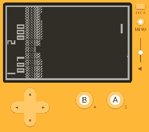
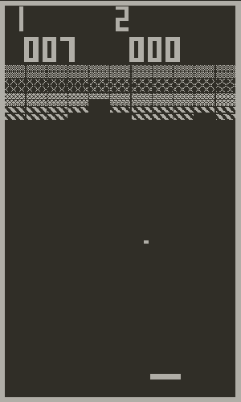

# Breakout

A clone of the Atari Breakout arcade game made for the [Playdate](https://play.date) handheld. Making a game that runs sideways is hard :/ This game does not use sprites and it constantly repaints the entire screen. There are a lot of improvements that could be made to be less taxing on the CPU and improve energy use (better battery life).

## Building from Source

See the `build_and_run.sh` file for reference. Adjust the path to `pdc` and the Playdate Simulator to match your environment.

## Images

